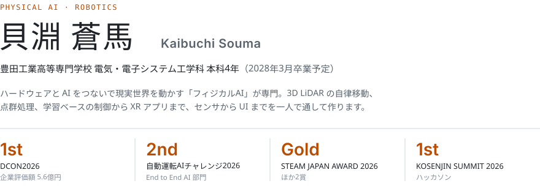
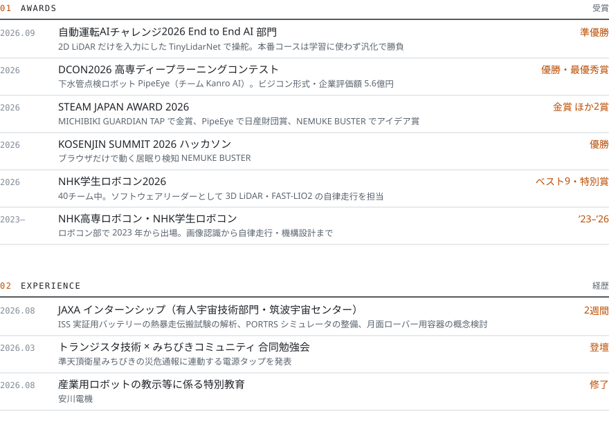
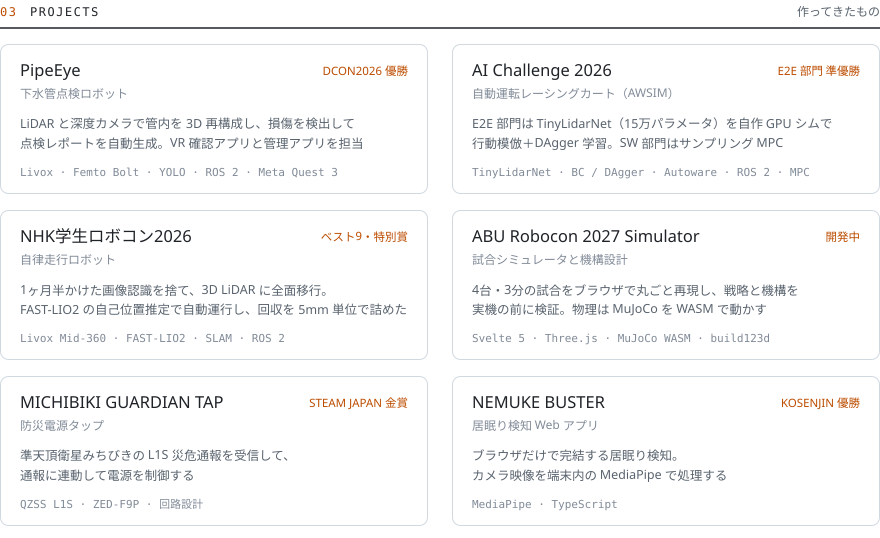
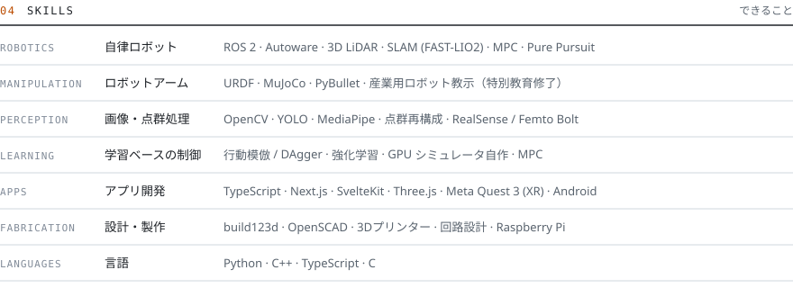

<picture>
  <source media="(prefers-color-scheme: dark)" srcset="./assets/profile/header-dark.svg" />
  
</picture>
  
<picture>
  <source media="(prefers-color-scheme: dark)" srcset="./assets/profile/record-dark.svg" />
  
</picture>
  
<picture>
  <source media="(prefers-color-scheme: dark)" srcset="./assets/profile/projects-dark.svg" />
  
</picture>
  
<picture>
  <source media="(prefers-color-scheme: dark)" srcset="./assets/profile/skills-dark.svg" />
  
</picture>
  

<picture>
  <source media="(prefers-color-scheme: dark)" srcset="https://raw.githubusercontent.com/Raptor-zip/Raptor-zip/main/profile-summary-card-output/github_dark/3-stats.svg" />
  
</picture>
<picture>
  <source media="(prefers-color-scheme: dark)" srcset="https://raw.githubusercontent.com/Raptor-zip/Raptor-zip/main/profile-summary-card-output/github_dark/2-most-commit-language.svg" />
  
</picture>

<!-- 画像は design/ の React コンポーネントから `npm run build` で生成している。内容の出典は Obsidian vault -->
